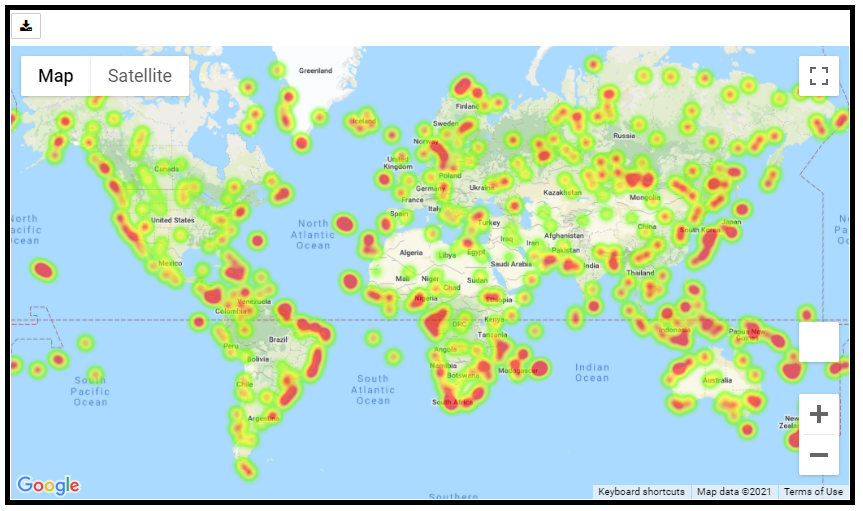
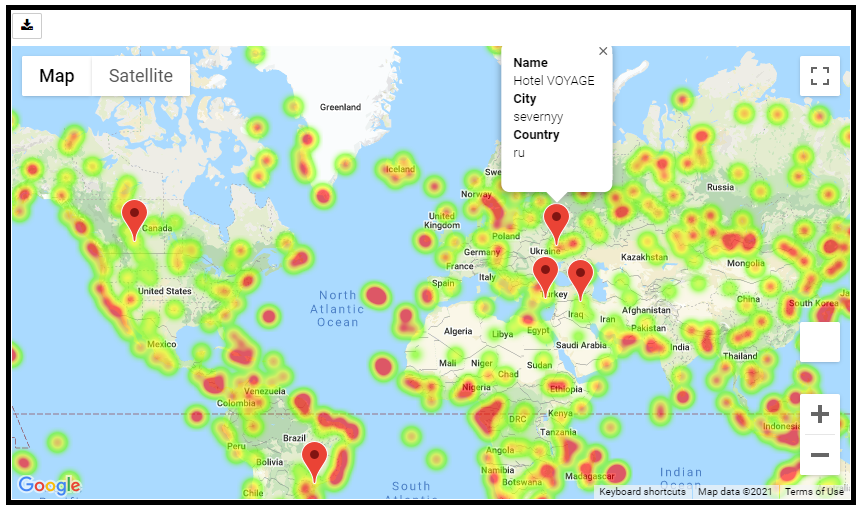

# GT Bootcamp Python API Homework: WeatherPy &amp; VacationPy

## Table of Contents
1. [Introduction](#introduction)
2. [Objectives](#objectives)
3. [Technologies](#technologies)
4. [Files](#files)
5. [Analysis](#analysis)

### Introduction
In WeatherPy, I have been tasked with using OpenWeatherMap API to analyze weather conditions as they relate to proximity to the equator.
In VacationPy, I have been tasked with using Google Places API to locate hotels in cities with current idyllic weather conditions and plotting them using GMAPS.

### Objectives

#### WeatherPy
Write a Python script in Jupyter Lab that:
* Utilizes CitiPy to randomly generate over 500 unique cities around the world
* Gathers current weather data from cities using OpenWeatherMap API calls
* Puts all data into a DataFrame and exports to a csv file
* Uses scatter plots to visualize the relationship between Latitude and Temperature, Humidity, Cloudiness, and Wind Speed
* Uses scatter plots and linear regressions to visualize and analyze the relationship between Latitude and Temperature, Humidity, Cloudiness, and Wind Speed

#### VacationPy
Write a Python script in Jupyter Lab that:
* Imports WeatherPy csv file
* Generates Humidity Heat Map using GMAPS
* Filters the DataFrame for idyllic vacation weather conditions
* Locates hotels in these idyllic cities using Google Places API calls
* Adds hotel markers to the Humidity Heat Map

### Technologies
This project uses: 
* Python Version 3.6.13
* Jupyter Lab Version 2.2.6
* OpenWeatherMap API Key: stored in a variable named api_key in a file named config.py in the WeatherPy directory
* Google API Key: stored in a variable named g_key in a file named config.py in the VacationPy directory
* Citipy Version: 0.0.5

### Files
* [WeatherPy.ipynb](WeatherPy/WeatherPy.ipynb): Jupyter Lab file with random city generator, successive OpenWeatherMap API calls, scatter plots, and linear regressions
* [weather_output.csv](WeatherPy/Output/weather_output.csv): output of WeatherPy results; table of random cities and weather conditions
* [Output Folder](WeatherPy/Output): folder containing all plots generated in WeatherPy as PNGs
* [Jupyter Notebook Viewer of WeatherPy.ipynb](https://nbviewer.jupyter.org/github/khutula/python-api-challenge/blob/main/WeatherPy/WeatherPy.ipynb): use this link to view the WeatherPy Jupyter Lab file in a friendly viewer version
* [VacationPy.ipynb](VacationPy/VacationPy.ipynb): Jupyter Lab file creating humidity Heat Map based on WeatherPy results and using Google Places API to generate hotels in cities with idyllic weather conditions
* [Jupyter Notebook Viewer of VacationPy.ipynb](https://nbviewer.jupyter.org/github/khutula/python-api-challenge/blob/main/VacationPy/VacationPy.ipynb): use this link to view the VacationPy Jupyter Lab file in a friendly viewer version

### Analysis

#### Scatter Plot Analysis
* There appears to be a relationship between Latitude and Max Temp. Max Temp increases as the Equator (Latitude = 0) is approached on each side.
* There doesn't appear to be any obvious relationship between Latitude and Humdity.
* There doesn't appear to be any obvious relationship between Latitude and Cloudiness.
* There doesn't appear to be any obvious relationship between Latitude and Wind Speed.

#### Hemisphere Linear Regression Analysis
* In the Northern Hemisphere, the r-value demonstrates a moderate, negative relationship between latitude and max temperature. This means that as you approach the equator (Latitude = 0), the temperature tends to be higher. In the Southern Hemisphere, the r-value demonstrates a strong, positive relationship between latitude and max temperature. This means that as you approach the equator, the temperature tends to be higher. Both graphs are simulating a similar relationship: the highest temps tend to occur nearest the equator, while the lowest temps tend to occur furthest away from the equator.
* In both the Northern and Southern Hemispheres, the r-values demonstrate a weak/non-existent relationship between latitude and humidity. This means that there is no evidence here to support a relationship between proximity to the equator and humidity.
* In both the Northern and Southern Hemispheres, the r-values demonstrate a weak/non-existent relationship between latitude and cloudiness. This means that there is no evidence here to support a relationship between proximity to the equator and cloudiness.
* In both the Northern and Southern Hemispheres, the r-values demonstrate a weak/non-existent relationship between latitude and wind speed. This means that there is no evidence here to support a relationship between proximity to the equator and wind speed.

#### Screenshot of Humidity Heat Map

#### Screenshot of Humidity Head Map with Hotel Markers
